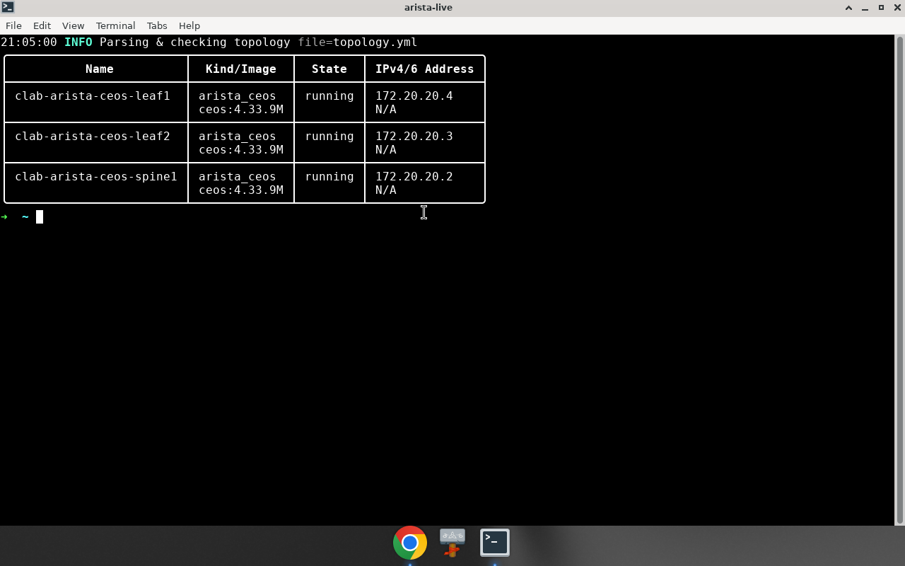
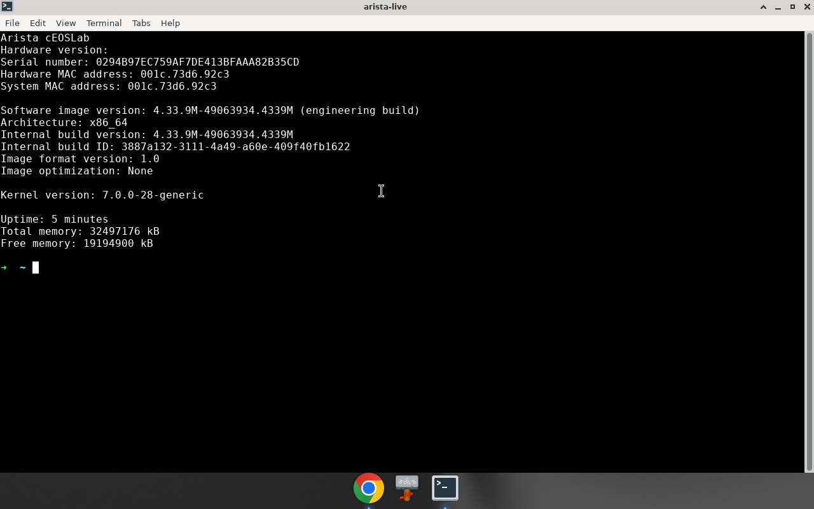
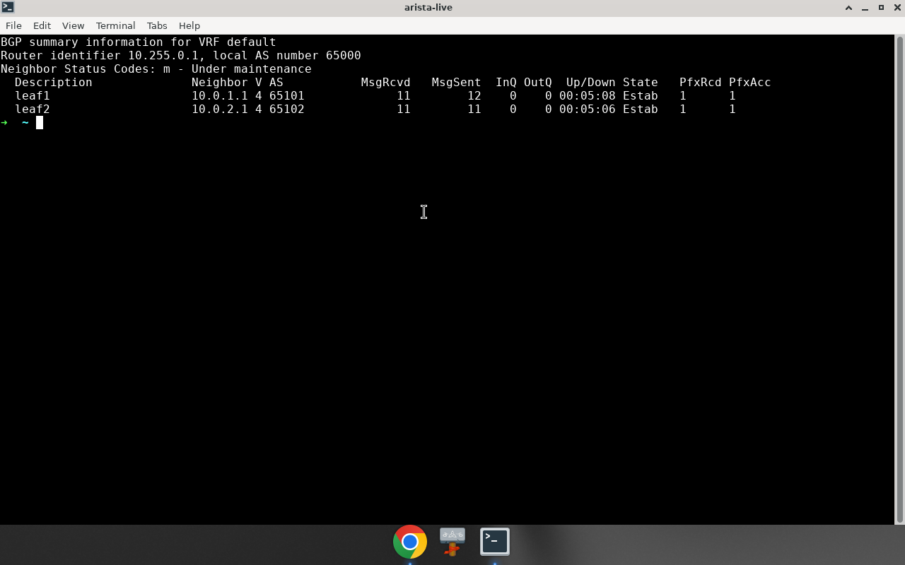
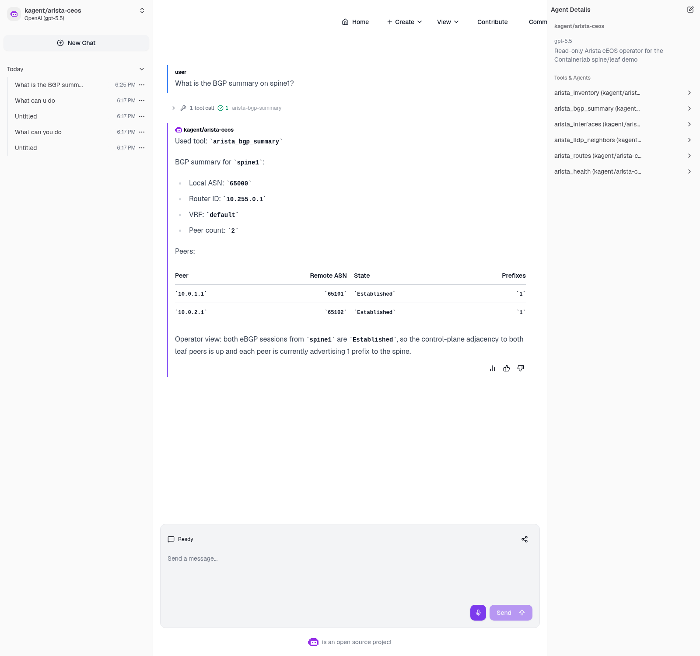
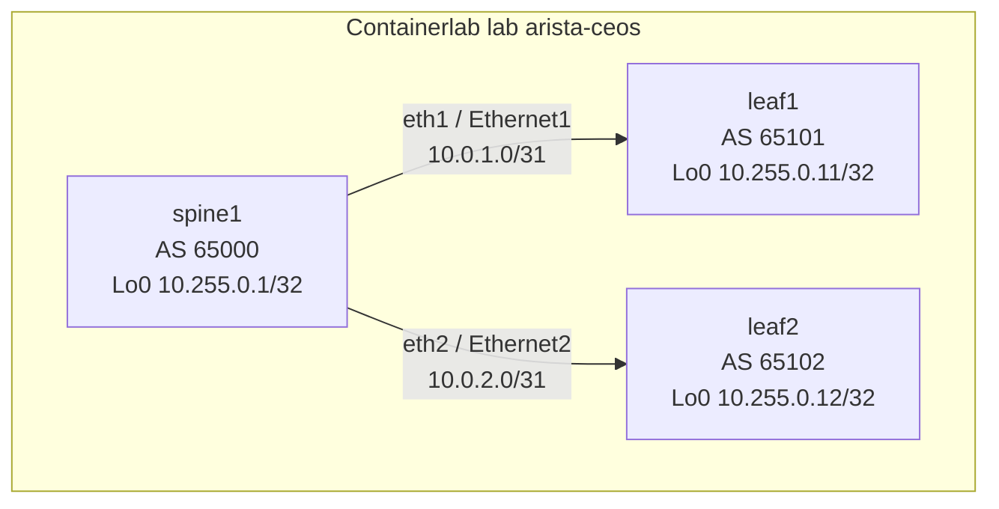
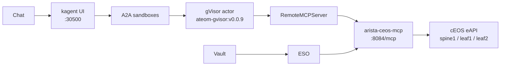

# arista-ceos-sandbox-agent

A **3-node Arista cEOS Containerlab** fabric (`spine1`, `leaf1`, `leaf2`)
for Sebastian’s Viper. eBGP underlay only in v1 (no MPLS, no EVPN yet).
A gVisor `SandboxAgent` + FastMCP path is **live** on Viper
(`SandboxAgent/arista-ceos`, kagent UI `:30500`).

**The fabric is live on Viper `172.16.10.135` (2026-08-17 evening ET).**
Live inspect, EOS version, and BGP are in **[REPORT.md](REPORT.md)**.
Live CLI and kagent screenshots are below. The mermaid diagrams are
topology only, not UI captures.

How-to (including the inotify first-boot failure): **[JOURNEY.md](JOURNEY.md)**.

## Live screenshots

Real captures from Viper on **2026-08-17**. Not reconstructed, not AI.

**containerlab inspect** — three `ceos:4.33.9M` nodes on `172.20.20.0/24`



**spine1 `show version`** — EOS `4.33.9M-49063934.4339M` x86_64



**spine1 `show ip bgp summary`** — both leaves Established



**kagent UI** — `arista-ceos` answering “What is the BGP summary on spine1?”



See [shots/NOTES.md](shots/NOTES.md) for provenance.

## Why this lab exists

The other demos in this repo talk to a box that already exists (AWS,
FortiGate, F5, ServiceNow). This one **is** the box: a small Clos-ish
underlay you can tear down. v1 stops at three switches and eBGP so
the routing and eAPI surface are boring and checkable. EVPN/VXLAN can
come later on the same loopbacks.

No Alpine clients in v1. Loopback pings from EOS are enough to prove
the underlay without extra links or VRFs.

cEOS is **Arista-licensed**. The image is **not** stored in this git
repo and is not republished from this repo. Do **not** `docker pull`
from Hub. On Viper the official tarball was imported to a local name
(this run did **not** pull `sebbycorp/ceosimage`):

```bash
docker import cEOS64-lab-4.33.9M.tar.xz ceos:4.33.9M
```

Pinned image in [clab/topology.yml](clab/topology.yml):
**`ceos:4.33.9M`** (`linux/amd64`). Live digest
`sha256:56fcaed9ef895428e760997eb59ebfca2df661c915f360ae2ba4284439c3bb4f`
(also tagged `ceos:latest` on Viper). Override with `CEOS_IMAGE` or
the `image:` line (local name only). If that image is missing, deploy
**fails** and tells you to import — it will not pull.

Host for this lab: Viper **`172.16.10.135`**, Ubuntu **24.04**,
Docker **29.4.0**, **amd64**. Containerlab **0.78.2** (commit
`8e6596157`, 2026-08-13) is installed at
`/usr/local/bin/containerlab`. The 3-node lab is **running**. The
kagent `SandboxAgent/arista-ceos` is **Ready** (MCP `arista-ceos-mcp:dev`).

## Architecture

v1 (this folder): Containerlab on Viper → three `arista_ceos` nodes →
eAPI/SSH/LLDP/eBGP on the management and fabric links. That path has
been run (see [REPORT.md](REPORT.md)).



Intended later (not in this folder, not claimed live):



Chat → kagent UI `:30500` → A2A sandboxes → gVisor actor →
`RemoteMCPServer` → MCP → cEOS **eAPI**. Vault / ESO sit on the side
(lab AAA never in the actor). That MCP and `SandboxAgent` are **live** as of 2026-08-17.

## Addressing (fabric; mgmt IPs from live inspect)

| Node | ASN | Loopback | Link |
|------|-----|----------|------|
| spine1 | 65000 | 10.255.0.1/32 | Ethernet1 `10.0.1.0/31` ↔ leaf1; Ethernet2 `10.0.2.0/31` ↔ leaf2 |
| leaf1 | 65101 | 10.255.0.11/32 | Ethernet1 `10.0.1.1/31` ↔ spine1 |
| leaf2 | 65102 | 10.255.0.12/32 | Ethernet1 `10.0.2.1/31` ↔ spine1 |

Management pool: **`172.20.20.0/24`** (`mgmt.ipv4-subnet` in the
topology). Per-node Management0 IPs are **not** hardcoded. Live
inspect this evening: spine1 `172.20.20.2`, leaf2 `172.20.20.3`,
leaf1 `172.20.20.4`. Scripts and a future MCP should use `docker
inspect`, `containerlab inspect`, or Docker DNS names such as
`clab-arista-ceos-spine1`. Vault (later) stores those discovered
hosts in `hosts_json`, not a single `host` key.

## Pins (do not bump the kagent pair)

| Piece | Value |
|-------|--------|
| kagent OSS Helm + CRDs | `0.10.0-rc2` (future agent; not applied here) |
| Agent Substrate Helm + CRDs | `0.0.9` (future agent; not applied here) |
| Worker image | `ghcr.io/kagent-dev/substrate/ateom-gvisor:v0.0.9` |
| Pattern (later) | Go Declarative `SandboxAgent` + FastMCP + `RemoteMCPServer` + ExternalSecret |
| Containerlab | **0.78.2** (commit `8e6596157`) at `/usr/local/bin/containerlab`; kind `arista_ceos` |
| Image (pin) | `ceos:4.33.9M` via `docker import` — no Hub pull |
| Image arch | `linux/amd64` (Viper is amd64) |
| Image digest (live) | `sha256:56fcaed9ef895428e760997eb59ebfca2df661c915f360ae2ba4284439c3bb4f` |
| Mgmt subnet | `172.20.20.0/24` — no hardcoded Ma0 |
| Underlay | eBGP IPv4, no MPLS |

rc2 always writes `ActorTemplate` with `spec.pauseImage` and
`env[].valueFrom.secretKeyRef`. Substrate **0.0.9** accepts that shape.
**0.0.12** does not. Do not “upgrade to fix” a Ready=False agent when
this demo grows a `SandboxAgent`.

## Folder

```text
arista-ceos-sandbox-agent/
  README.md                 # visual landing (this file) — live shots below
  JOURNEY.md                # reproducible Containerlab setup + live inotify note
  REPORT.md                 # LIVE 2026-08-17 Viper record
  .env.example              # image + lab-only AAA names (copy to .env)
  clab/                     # topology + startup-config templates
  scripts/                  # prereqs, deploy, verify, destroy
  skills/                   # intended read-only Arista operations
  shots/                    # live CLI + kagent PNG captures (2026-08-17)
```

## Docs

| If you want… | Open |
|--------------|------|
| How to deploy on Viper | [JOURNEY.md](JOURNEY.md) |
| Live numbers (2026-08-17) | [REPORT.md](REPORT.md) |
| Intended agent skills | [skills/SKILL.md](skills/SKILL.md) |
| What shots are allowed | [shots/NOTES.md](shots/NOTES.md) |

## Honest limits

- The 3-node fabric is **live** on Viper. The kagent `SandboxAgent`
  is **Ready**. The kagent chat shot above is a real capture.
- cEOS is Arista-licensed. This repo does not vendor the tarball.
  Scripts never `docker pull`. Missing `ceos:4.33.9M` is a hard fail
  with an import hint. This run did not pull `sebbycorp/ceosimage`.
- Custom startup-config replaces Containerlab’s generated
  `admin`/`admin` user, so deploy **renders** AAA from `.env` (or the
  documented Containerlab default) into gitignored `clab/generated/`.
- Future kagent must use Vault `secret/platform/arista-ceos` keys
  `username`, `password`, `hosts_json` — not a password in a ConfigMap
  and not a single `host` key.
- No write tools are specified. The intended agent is read-only.
- No Linux clients in v1.
- kagent UI `http://172.16.10.135:30500/` is **LAN-only**.
- Never commit `.env`, Vault tokens, or eAPI password **values**.
- First boot on this host died on inotify / Too many open files.
  The sysctl fix is in [JOURNEY.md](JOURNEY.md).
