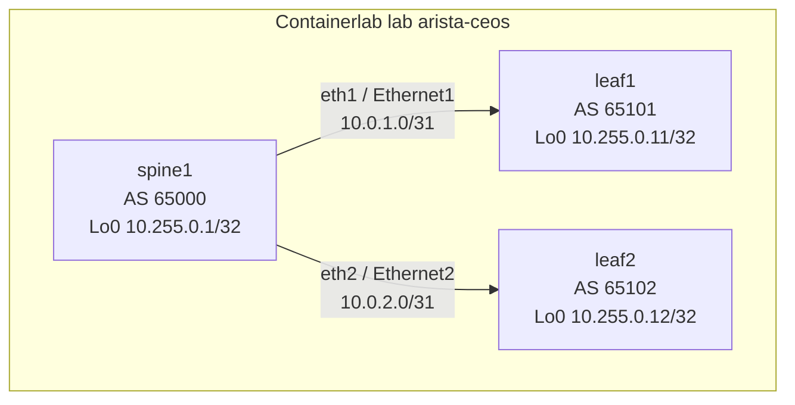
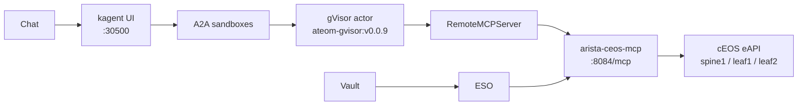

# arista-ceos-sandbox-agent

A **3-node Arista cEOS Containerlab** fabric (`spine1`, `leaf1`, `leaf2`)
for Sebastian’s Viper. eBGP underlay only in v1 (no MPLS, no EVPN yet).
A gVisor `SandboxAgent` + FastMCP path is the intended next step — it
is **not deployed** in this folder.

**Live screenshots and REPORT.md numbers are pending.** This README is
the architecture landing. Do not treat the diagrams as a completed
Viper run. Nothing below is a live BGP table, LLDP dump, or UI capture.

How-to is **[JOURNEY.md](JOURNEY.md)**. The report template (explicitly
**NOT YET RUN**): **[REPORT.md](REPORT.md)**.

## Live screenshots

**Pending until the lab is deployed and verified on Viper.**

Do not add reconstructed frames, stock photos, or AI-drawn “sample”
UI. When the fabric has been run, put real Chromium / CLI artifacts
in [shots/](shots/) and follow [shots/NOTES.md](shots/NOTES.md).

## Why this lab exists

The other demos in this repo talk to a box that already exists (AWS,
FortiGate, F5, ServiceNow). This one **is** the box: a small Clos-ish
underlay you can tear down. v1 stops at three switches and eBGP so
the routing and eAPI surface are boring and checkable. EVPN/VXLAN can
come later on the same loopbacks.

No Alpine clients in v1. Loopback pings from EOS are enough to prove
the underlay without extra links or VRFs.

cEOS is **Arista-licensed**. The image is **not** stored in this git
repo and is not republished from here. Default pull name:
`sebbycorp/ceosimage:latest` (override with `CEOS_IMAGE` or the
`image:` line in [clab/topology.yml](clab/topology.yml)). Docker Hub
also has `sebbycorp/ceosimage:4.33.4M`. Hub tags inspected 2026-08-18
were **arm64**.

## Architecture

v1 (this PR): Containerlab on Viper → three `arista_ceos` nodes →
eAPI/SSH/LLDP/eBGP on the management and fabric links.



Intended later (not in this folder, not claimed live):



Chat → kagent UI `:30500` → A2A sandboxes → gVisor actor →
`RemoteMCPServer` → MCP → cEOS **eAPI**. Vault / ESO sit on the side
(lab AAA never in the actor). That MCP and `SandboxAgent` are **not**
in this v1.

## Addressing (planned fabric, not a live table)

| Node | ASN | Loopback | Link |
|------|-----|----------|------|
| spine1 | 65000 | 10.255.0.1/32 | Ethernet1 `10.0.1.0/31` ↔ leaf1; Ethernet2 `10.0.2.0/31` ↔ leaf2 |
| leaf1 | 65101 | 10.255.0.11/32 | Ethernet1 `10.0.1.1/31` ↔ spine1 |
| leaf2 | 65102 | 10.255.0.12/32 | Ethernet1 `10.0.2.1/31` ↔ spine1 |

Management0 IPs are **not** hardcoded. Containerlab/Docker assign them.
Scripts and a future MCP should use `docker inspect`, `containerlab
inspect`, or Docker DNS names such as `clab-arista-ceos-spine1`.

## Pins (do not bump the kagent pair)

| Piece | Value |
|-------|--------|
| kagent OSS Helm + CRDs | `0.10.0-rc2` (future agent; not applied here) |
| Agent Substrate Helm + CRDs | `0.0.9` (future agent; not applied here) |
| Worker image | `ghcr.io/kagent-dev/substrate/ateom-gvisor:v0.0.9` |
| Pattern (later) | Go Declarative `SandboxAgent` + FastMCP + `RemoteMCPServer` + ExternalSecret |
| Containerlab kind | `arista_ceos` |
| Image (default) | `sebbycorp/ceosimage:latest` |
| Underlay | eBGP IPv4, no MPLS |

rc2 always writes `ActorTemplate` with `spec.pauseImage` and
`env[].valueFrom.secretKeyRef`. Substrate **0.0.9** accepts that shape.
**0.0.12** does not. Do not “upgrade to fix” a Ready=False agent when
this demo grows a `SandboxAgent`.

## Folder

```text
arista-ceos-sandbox-agent/
  README.md                 # visual landing (this file) — shots pending
  JOURNEY.md                # reproducible Containerlab setup
  REPORT.md                 # NOT YET RUN template
  .env.example              # image + lab-only AAA names (copy to .env)
  clab/                     # topology + startup-config templates
  scripts/                  # prereqs, deploy, verify, destroy
  skills/                   # intended read-only Arista operations
  shots/                    # empty until a real live run
```

## Docs

| If you want… | Open |
|--------------|------|
| How to deploy on Viper | [JOURNEY.md](JOURNEY.md) |
| Live numbers (none yet) | [REPORT.md](REPORT.md) |
| Intended agent skills | [skills/SKILL.md](skills/SKILL.md) |
| What shots are allowed | [shots/NOTES.md](shots/NOTES.md) |

## Honest limits

- **Build/deploy pending.** Verify has not been run against Viper in
  this change. Do not copy imagined `show ip bgp summary` output.
- cEOS is Arista-licensed. This repo does not vendor the image and
  does not include Docker Hub credentials.
- Custom startup-config replaces Containerlab’s generated
  `admin`/`admin` user, so deploy **renders** AAA from `.env` (or the
  documented Containerlab default) into gitignored `clab/generated/`.
- Future kagent must use Vault `secret/platform/arista-ceos`, not a
  password baked into a ConfigMap.
- No write tools are specified. The intended agent is read-only.
- No Linux clients in v1.
- kagent UI `http://172.16.10.135:30500/` is **LAN-only** and is not
  part of this v1 deploy.
- Never commit `.env`, Vault tokens, or eAPI password **values**.
