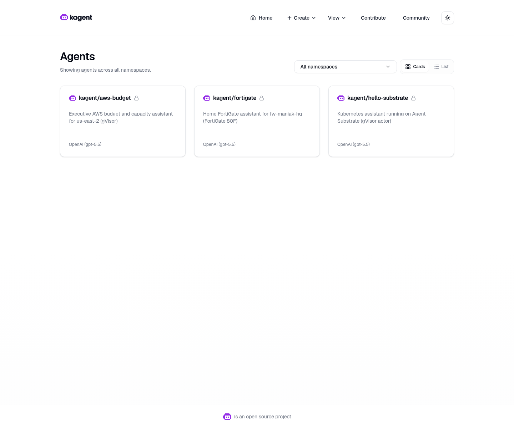
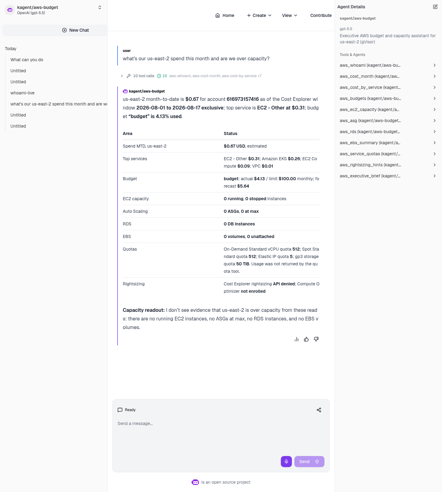

# Journey: AWS budget SandboxAgent on Viper

**Visual start:** [README.md](README.md) (screenshots + architecture).
**What we actually did on Viper** (2026-08-16, America/Toronto):
**[REPORT.md](REPORT.md)**. This file is the how-to. The report
is the live lab record. Screenshots and gifs of that run:
**[shots/](shots/)**.

This is the human path. Do it in order. Each step says **what you type
or click**, **what you should see**, and **why it matters**. Copy-paste
without the story is [docs/cli-runbook.md](docs/cli-runbook.md).

You are building a **gVisor-sandboxed** executive assistant that can
answer *“what’s our us-east-2 spend this month and are we over
capacity?”* without holding AWS keys in git and without a generic
shell to the AWS CLI.

Lab: Sebastian’s Viper, `172.16.10.135`, dockerized k3s (`k3s-viper`).
kubectl is `docker exec k3s-viper kubectl …`.

---

## 1. Why Substrate (isolated sandboxes, not a plain Agent)

A normal kagent `Agent` is a Kubernetes Deployment: always on, same
isolation as any other pod. Fine for a cluster helper.

This `aws-budget` agent talks to the AWS bill. The model gets a
filesystem, memory, and a network for the whole chat. Substrate puts
that session in a **gVisor actor** (`SandboxAgent`) on WorkerPool
`kagent-default`:

- **Isolated sandbox:** gVisor is the wall between the model session
  and the Viper/k3s host. Tools still call AWS through the MCP pod;
  keys stay in Vault, not in the actor.
- Idle chats **snapshot** (zstd) and free the worker. The next
  message restores the same session instead of booting a new
  container.
- No always-on pod per executive conversation.
- A **golden snapshot** you can resume.

**Tradeoff on this lab (honest):** nested gVisor on dockerized k3s,
and snapshots are in-cluster rustfs today (`gs://` is a URI prefix
only), not GCS.

These are isolated sandboxes, not plain Agents. The kagent UI shows a
**Sandbox: Agent Substrate** badge on the three cards (`aws-budget`,
`fortigate`, `hello-substrate`). Classic `/api/a2a/<ns>/<name>`
**404s** because there is no `Agent` CR; the UI uses
`/api/a2a-sandboxes/kagent/aws-budget`.

**Live UI** (Chromium screenshot of the tunneled kagent SPA,
2026-08-16 — not reconstructed):



*Live kagent UI, 2026-08-16. Three SandboxAgent cards, all OpenAI
gpt-5.5. `aws-budget` description: “Executive AWS budget and capacity
assistant for us-east-2 (gVisor).”*

If you only needed a Python container with boto3 and no snapshot
lifecycle, a Deployment would be enough. That is **not** this demo.

**What you should already see on Viper** (proof the runtime exists):

```bash
docker exec k3s-viper kubectl -n kagent get sandboxagents,workerpool
docker exec k3s-viper kubectl -n ate-system get pods
```

`hello-substrate` and `fortigate` Ready means the pairing below works.
If they are not Ready, fix the lab first — do not add a third agent on
a broken control plane.

---

## 2. Why 0.10.0-rc2 + 0.0.9 (and not 0.0.12)

Official published pairing:

| kagent | Substrate |
|--------|-----------|
| Helm/CRDs **0.10.0-rc2** | Helm/CRDs **0.0.9** |
| `go.mod` replace `substrate v0.0.9` | Worker `ateom-gvisor:v0.0.9` |

kagent rc2 **always** writes `ActorTemplate` with:

- `spec.pauseImage`
- `env[].valueFrom.secretKeyRef` (`KAGENT_CONFIG_JSON`,
  `KAGENT_AGENT_CARD_JSON`, `KAGENT_SRT_SETTINGS_JSON`, `OPENAI_API_KEY`)

Substrate **0.0.9** CRDs accept that. **0.0.12** removed `valueFrom`
and moved pause image to `SandboxConfig`. The apiserver then rejects
rc2’s object (`Ready=False`, `ActorTemplateNotFound`, or
`spec.containers[0].env[…].value: Required value`).

**Do not bump** either version to “fix” Ready. **Do not** edit the
SandboxAgent YAML to flatten env into literals. Pin mismatch is a
CRD problem.

Why this matters: the first time `aws-budget` is not Ready, you will
be tempted to upgrade. That is how Viper already burned time. Stay on
0.0.9.

---

## 3. Snapshots today: rustfs (omit snapshotsConfig)

Substrate checkpoints actor RAM/filesystem to **object storage**.
On live Viper (read-only, confirmed) that storage is **in-cluster rustfs**,
not Google Cloud.

| | Today on Viper |
|--|--|
| atelet 0.0.9 | `ATE_STORAGE_BACKEND=s3` → `http://rustfs.ate-system.svc:9000` |
| rustfs bucket | `ate-snapshots` (1Gi PVC) |
| hello-substrate / fortigate | **omit** `snapshotsConfig` |
| kagent default | ActorTemplate location `gs://ate-snapshots/kagent/<name>` |
| Where bytes live | rustfs. The `gs://` scheme is a **prefix only**. |

`k8s/sandboxagent.yaml` therefore **omits** `snapshotsConfig`, same as
the two live agents. Expected default:

`gs://ate-snapshots/kagent/aws-budget`

**Do not** set `gs://viper-kagent-ate-snapshots/...` on this agent.
atelet would look for that bucket **on rustfs**, it does not exist, and
the golden snapshot would fail.

**What you should see after apply:**

```bash
docker exec k3s-viper kubectl -n kagent get actortemplate aws-budget \
  -o jsonpath='{.spec.snapshotsConfig.location}{"\n"}{.status.goldenSnapshot}{"\n"}'
docker exec k3s-viper kubectl -n ate-system get pods,svc
```

Location is `gs://ate-snapshots/kagent/aws-budget`. `goldenSnapshot` is
that prefix plus `/<actorId>/<timestamp>-<rand>` when Ready. rustfs is
up in `ate-system`.

---

## 4. GCP bucket exists — reserved for a later atelet cutover

Project **viper-kagent** (89434469276, org **maniak.io**) and bucket
**gs://viper-kagent-ate-snapshots** (`us-east1`) **already exist**.
They are reserved for a **cluster-wide** atelet cutover off rustfs.
**Do not create another project or bucket. Do not set that URI on
this SandboxAgent yet.**

Path A (native GCS ADC) and Path B (HMAC +
`https://storage.googleapis.com`) are **future work** — see
[docs/snapshots-gcs.md](docs/snapshots-gcs.md). Today: stay rustfs.

**CLI** (verify only; skips create):

```bash
./scripts/01-gcp-snapshot-bucket.sh
```

**What you should see:** project `viper-kagent`, bucket
`gs://viper-kagent-ate-snapshots`, `existing lab … — skip create`,
and a note that the SandboxAgent must **not** use that URI yet.

---

## 5. Create the AWS IAM user / role for the agent

**Click path:** AWS console, region **us-east-2** → IAM → create user
`aws-budget-agent` (no console password) → attach the customer-managed
policy in [docs/security.md](docs/security.md) → create an access key
(use case: “Application running outside AWS”).

**What you should see:** Access key id starting with `AKIA…` and a
secret shown **once**.

**Why a dedicated identity:** the agent is read-mostly. It must not
share a human admin key. The policy is `ce:Get*`, `budgets:View*`,
`ec2:Describe*` (and siblings) **conditioned to us-east-2** where
IAM allows it. No terminate, no IAM create, no `s3:*` on your data.

Enable **Cost Explorer** in the billing console if the account has
never used it. Otherwise `aws_cost_*` will fail honestly — that is
success, not a reason to fake $0.

Optional: enroll Compute Optimizer / CE rightsizing. If you skip it,
`aws_rightsizing_hints` must say “not available.”

---

## 6. Put keys in Vault, never git

On Viper, Vault UI is [http://172.16.10.135:30200/](http://172.16.10.135:30200/)
(unseal first if the pod restarted).

```bash
docker exec -it k3s-viper kubectl -n vault exec -i vault-0 -- \
  vault kv put secret/platform/aws-budget \
    access_key_id='<paste>' \
    secret_access_key='<paste>' \
    region='us-east-2'
```

**What you should see:** `created` / a new version of
`secret/data/platform/aws-budget`. Then:

```bash
docker exec k3s-viper kubectl -n kagent get externalsecret aws-budget-mcp
```

After `kubectl apply`, `STATUS` should become `SecretSynced`. The
Kubernetes Secret `aws-budget-mcp` appears. **Do not** `kubectl get
secret -o yaml` and paste it into Slack.

**Why Vault:** ESO already exists on Viper
(`ClusterSecretStore/vault-backend`). FortiGate uses the same pattern
(`secret/platform/fortigate`). Git only has the ExternalSecret
*mapping*.

---

## 7. Build and import the MCP image on k3s

Same local-import pattern as `fortigate-mcp:dev`. There is no registry
pull for `aws-budget-mcp:dev`.

On Viper, from this repo root:

```bash
./aws-sandbox-agent/scripts/02-build-import-mcp.sh
```

**What you should see:** a docker build, then `ctr images import`
listing `aws-budget-mcp:dev`. If the pod is `ImagePullBackOff`, the
import did not land or the tag does not match.

**Why import:** dockerized k3s does not see host Docker images until
you `ctr images import`. `imagePullPolicy: IfNotPresent` is
intentional.

---

## 8. Apply SandboxAgent + RemoteMCPServer

```bash
kubectl kustomize aws-sandbox-agent/k8s | docker exec -i k3s-viper kubectl apply -f -
```

**What you should see:**

```text
externalsecret.external-secrets.io/aws-budget-mcp created
deployment.apps/aws-budget-mcp created
service/aws-budget-mcp created
configmap/aws-budget-skills created
remotemcpserver.kagent.dev/aws-budget-mcp created
sandboxagent.kagent.dev/aws-budget created
```

Then:

```bash
docker exec k3s-viper kubectl -n kagent get sandboxagents,remotemcpservers
docker exec k3s-viper kubectl -n kagent get deploy,pods -l app.kubernetes.io/name=aws-budget-mcp
```

MCP pod `1/1 Ready`. `RemoteMCPServer` Accepted. `SandboxAgent`
may sit NotReady for a minute.

---

## 9. Chat in the kagent UI

1. Open [http://172.16.10.135:30500/](http://172.16.10.135:30500/).
2. Pick **kagent/aws-budget** (not hello-substrate, not fortigate).
3. Ask:

   > What's our us-east-2 spend this month and are we over capacity?

**What you should see:** tool calls — at least `aws_whoami`,
`aws_cost_month`, `aws_ec2_capacity` (or the composed
`aws_executive_brief`). Dollars and instance counts that match
`scripts/03-smoke-aws.sh` on your laptop.

**Live UI** (Chromium screenshot of the same chat, 2026-08-16 — not
reconstructed):



*Live kagent UI, 2026-08-16. User asked us-east-2 spend and capacity.
10/10 tools. MTD **$0.67**. Budget **$4.13 / $100**. 0 EC2 / 0 ASG /
0 RDS / 0 EBS.*

A **live UI** of that same live A2A turn (not a Chromium
pixel capture of the SPA):
[ui-chat-session.png](shots/ui-chat-session.png)
([mp4](shots/ui-chat-session.png)).

**If the model invents spend:** the tools did not run or CE is denied.
Say “call the tools; do not estimate.” Check MCP logs:

```bash
docker exec k3s-viper kubectl -n kagent logs deploy/aws-budget-mcp
```

The process must never print the secret key.

---

## 10. What “Ready / ActorTemplate golden snapshot” means

kagent does not run your Go agent by starting a Deployment of the
LLM runtime. It creates an `ActorTemplate` (owned by the SandboxAgent).
Substrate boots a **golden** actor once, checkpoints it, and stores
that checkpoint as `status.goldenSnapshot`.

| You see | Meaning |
|---------|---------|
| `ActorTemplate` missing | CRD pin wrong (0.0.12) or controller not reconciling |
| Template exists, no `goldenSnapshot` | First checkpoint still running (60–90s is normal) or gVisor/atelet cannot write storage |
| `Ready=True` + `goldenSnapshot: gs://…` | New chats restore from that image; you can talk |

```bash
docker exec k3s-viper kubectl -n kagent get actortemplates
docker exec k3s-viper kubectl -n kagent get sandboxagent aws-budget
```

Nested gVisor on dockerized k3s can still fail (`runsc`). That is a
known Viper risk. It does not mean you should convert this to a plain
Agent.

---

## 11. How we will record the video (UI + CLI)

Record two panes. **Redact** Vault tokens, AWS secrets, HMAC secrets.

**CLI reel (about two minutes):**

1. `scripts/00-prereqs.sh` — tools present, cluster reachable.
2. `scripts/01-gcp-snapshot-bucket.sh` — reserved GCS exists
   (skip-create). Do **not** put that URI on the SandboxAgent.
   Today snapshots are rustfs `gs://ate-snapshots/kagent/aws-budget`.
3. Vault `kv put` with the secret **off screen** or `***`.
4. `scripts/02-build-import-mcp.sh`.
5. `kubectl apply` + `get sandboxagent -w` until Ready.
6. `scripts/03-smoke-aws.sh` so the UI numbers have a ground truth.

**UI reel:**

1. Optional: GCP console shows reserved **viper-kagent** /
   **viper-kagent-ate-snapshots** (already exist — do not create,
   do not wire). Snapshots today are rustfs.
2. AWS IAM policy attach (no key download on camera).
3. kagent `:30500` → Agents → `aws-budget` Ready.
4. The spend/capacity question → tool calls → executive-shaped answer.

Clicks-only checklist: [docs/ui-runbook.md](docs/ui-runbook.md).

---

## Skills (in this repo)

All agent skills live under [skills/](skills/SKILL.md). kagent
**0.10.0-rc2** rejects `spec.skills` on `SandboxAgent` (same as
`fortigate` / `hello-substrate` on k8s-viper — those agents inline
instructions in `systemMessage`). There is no skill-mount into the
gVisor session. ConfigMap `aws-budget-skills` holds the same text;
`declarative.promptTemplate` includes it in `systemMessage` so the
model actually sees it. Keep `skills/` in sync with
`k8s/skills-configmap.yaml`. Do not add a second skill pack in
another repository for this demo.
