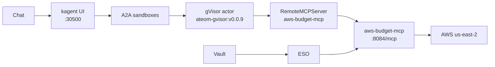

# aws-sandbox-agent

A gVisor `SandboxAgent` for executive AWS budget and capacity in
**us-east-2** on Viper (kagent **0.10.0-rc2** + Agent Substrate **0.0.9**).

## Live screenshots


*Live kagent UI, 2026-08-16. Isolated sandboxes (not plain Agents) —
three SandboxAgent cards.*


*Live kagent UI, 2026-08-16. Isolated sandbox chat: $0.67 MTD
us-east-2 spend and capacity.*

How-to is **[JOURNEY.md](JOURNEY.md)**. What we actually did on Viper
(2026-08-16, America/Toronto): **[REPORT.md](REPORT.md)**.

## Why isolated sandboxes (not a plain Agent)

A normal kagent `Agent` is a Kubernetes Deployment: always on, same
isolation as any other pod. Fine for a cluster helper.

This agent talks to the AWS bill. The model gets a filesystem, memory,
and a network for the whole chat. Substrate puts that session in a
**gVisor actor** (`SandboxAgent`) on WorkerPool `kagent-default`:

- Isolated sandbox: gVisor is the wall between the model session and
  the Viper/k3s host. Tools still call AWS through the MCP pod; keys
  stay in Vault, not in the actor.
- Idle chats snapshot (zstd) and free the worker. Next message
  restores the same session instead of booting a new container.
- No always-on pod per executive conversation.
- Golden snapshot you can resume.

**Tradeoff on this lab:** nested gVisor on dockerized k3s, and
snapshots are in-cluster rustfs today (`gs://` is a URI prefix only),
not GCS.

The kagent UI shows a **Sandbox: Agent Substrate** badge on the three
cards. Classic `/api/a2a/<ns>/<name>` 404s (no `Agent` CR); the UI
uses `/api/a2a-sandboxes/kagent/aws-budget`.

## Architecture

Chat → kagent UI `:30500` → A2A sandboxes → gVisor actor →
`RemoteMCPServer` → `aws-budget-mcp` → AWS **us-east-2**. Vault / ESO
sit on the side (keys never in the actor). Full request path and
snapshot notes: **[docs/architecture.md](docs/architecture.md)**.




*Reconstructed reel of that same A2A turn (not a Chromium pixel
capture of the SPA). [mp4](shots/aws-budget-kagent-demo.mp4)*

## What you will have at the end

1. A Go declarative `SandboxAgent` named **`aws-budget`** in namespace `kagent`,
   talking through WorkerPool **`kagent-default`** (`ateom-gvisor:v0.0.9`).
2. A FastMCP server (`aws-budget-mcp:dev`) on **`:8084/mcp`**
   (`STREAMABLE_HTTP`), registered as `RemoteMCPServer/aws-budget-mcp`.
3. AWS credentials in **Vault** `secret/platform/aws-budget`, synced by
   External Secrets Operator. **No keys in git.**
4. Substrate snapshots on **rustfs** today (`gs://ate-snapshots/kagent/aws-budget`
   prefix; omit `snapshotsConfig`, same as hello-substrate / fortigate).
   GCP project **viper-kagent** / **gs://viper-kagent-ate-snapshots**
   already exist and are reserved for a later cluster-wide atelet
   cutover — do not create another, do not set that URI on this agent
   yet. See [docs/snapshots-gcs.md](docs/snapshots-gcs.md).
5. A chat in the kagent UI (`http://172.16.10.135:30500/`) that can answer:

   > What's our us-east-2 spend this month and are we over capacity?

   with **real** Cost Explorer / EC2 / quota numbers — never invented.

## Pins (do not bump)

| Piece | Value |
|-------|--------|
| kagent OSS Helm + CRDs | `0.10.0-rc2` |
| Agent Substrate Helm + CRDs | `0.0.9` |
| Worker image | `ghcr.io/kagent-dev/substrate/ateom-gvisor:v0.0.9` |
| Pattern | Go Declarative `SandboxAgent` + FastMCP + `RemoteMCPServer` + ExternalSecret |
| Model | `default-model-config` (Viper: gpt-5.5 via agentgateway) |
| AWS region | **us-east-2** only |

rc2 always writes `ActorTemplate` with `spec.pauseImage` and
`env[].valueFrom.secretKeyRef`. Substrate **0.0.9** accepts that shape.
**0.0.12** does not. Do not “upgrade to fix” a Ready=False agent.

## Folder

```text
aws-sandbox-agent/
  README.md                 # visual landing (this file)
  JOURNEY.md                # how-to
  REPORT.md                 # what we actually did on Viper (2026-08-16)
  shots/                    # live Chromium UI + reconstructed A2A reel
  docs/                     # architecture, runbooks, security, snapshots
  skills/                   # source for ConfigMap aws-budget-skills
  images/aws-budget-mcp/    # FastMCP image
  k8s/                      # SandboxAgent + MCP + ExternalSecret + skills ConfigMap
  scripts/                  # prereqs, GCS bucket, image import, AWS smoke
```

## Docs

| If you want… | Open |
|--------------|------|
| Architecture (full mermaid + request path) | [docs/architecture.md](docs/architecture.md) |
| How-to (every click) | [JOURNEY.md](JOURNEY.md) |
| What we actually did on Viper | [REPORT.md](REPORT.md) |
| IAM / Vault / gVisor | [docs/security.md](docs/security.md) |
| Snapshot storage | [docs/snapshots-gcs.md](docs/snapshots-gcs.md) |
| Commands only | [docs/cli-runbook.md](docs/cli-runbook.md) |
| Console clicks only | [docs/ui-runbook.md](docs/ui-runbook.md) |
| Agent skills | [skills/SKILL.md](skills/SKILL.md) |
| All shots | [shots/](shots/) |

## Honest limits

- Image must be imported on the k3s node (`ctr images import`) before the MCP pod starts.
- Vault path must exist or ExternalSecret stays unsynced.
- Cost Explorer and Budgets APIs live in **us-east-1**; tools still **filter** to us-east-2.
- There is **no** generic “run any aws cli” tool. No IAM create, no terminate, no budget-delete.
- Never commit AWS or GCP secret **values**.
