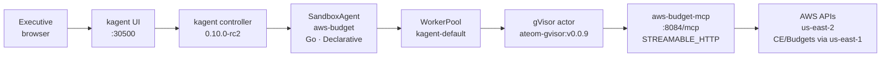
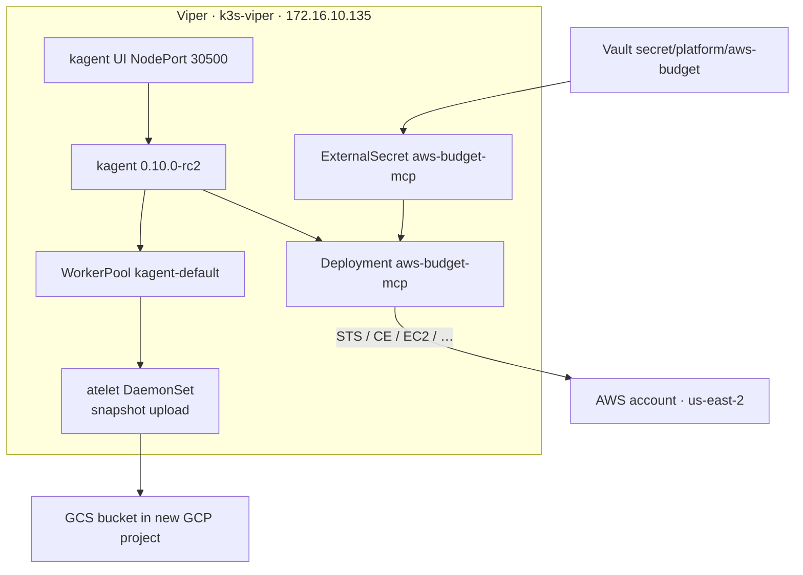

# Architecture

Executive chat in the kagent UI becomes a gVisor actor that calls a
read-mostly FastMCP server, which calls AWS **us-east-2**. Actor memory
snapshots are meant to land in a **GCS bucket in a new GCP project**.

## Request path



Same path in the lab's usual text form:

```text
kagent UI :30500
    → SandboxAgent/aws-budget  (Go, modelConfig default-model-config)
        → Agent Substrate WorkerPool kagent-default  (gVisor ateom)
            → RemoteMCPServer/aws-budget-mcp
                  http://aws-budget-mcp.kagent:8084/mcp
                → Deployment/aws-budget-mcp  (image aws-budget-mcp:dev)
                    → AWS us-east-2  (keys from Vault via ExternalSecret)
```

## Secrets and snapshots



## Why this is not a plain `Agent` Deployment

A regular kagent `Agent` is a long-running pod. `SandboxAgent` is a
**Substrate actor**: idle sessions checkpoint (zstd) and the worker is
freed. The next chat restores from a snapshot inside **gVisor**, so
untrusted tool use stays off the k3s host. That is the point of this demo.

## Snapshot location (two layers — do not collapse them)

| Layer | What it is | What we set |
|-------|------------|-------------|
| kagent CRD | `SandboxAgent.spec.substrate.snapshotsConfig.location` | Must match `^gs://`. Default if unset: `gs://ate-snapshots/<ns>/<name>/` |
| atelet backend | GCS **or** S3 client, chosen at **atelet startup** | Stock substrate Helm often ships in-cluster **rustfs** (S3). Native GCS needs the GCS client + ADC |

kagent 0.10.0-rc2 will **reject** `s3://…` on `snapshotsConfig.location`
(API: *“Substrate currently expects a gs:// location”*, pattern `^gs://`).
See [snapshots-gcs.md](snapshots-gcs.md) for how that interacts with rustfs
and with GCS HMAC / `https://storage.googleapis.com`.

## MCP tools (read-only first)

| Tool | AWS API (typical) |
|------|-------------------|
| `aws_whoami` | `sts:GetCallerIdentity` |
| `aws_cost_month` | `ce:GetCostAndUsage` (REGION=us-east-2) |
| `aws_cost_by_service` | `ce:GetCostAndUsage` GROUP BY SERVICE |
| `aws_budgets` | `budgets:ViewBudget` / DescribeBudgets |
| `aws_ec2_capacity` | `ec2:DescribeInstances` |
| `aws_asg` | `autoscaling:DescribeAutoScalingGroups` |
| `aws_rds` | `rds:DescribeDBInstances` |
| `aws_ebs_summary` | `ec2:DescribeVolumes` |
| `aws_service_quotas` | `servicequotas:GetServiceQuota` / `List*` |
| `aws_rightsizing_hints` | `ce:GetRightsizingRecommendation` or `compute-optimizer:Get*` |
| `aws_executive_brief` | composes the above |

No generic CLI. No IAM create, terminate, or budget-delete.

## Related

- Human walkthrough: [../JOURNEY.md](../JOURNEY.md)
- Pins and pairing: same as [k8s-viper `docs/kagent-substrate.md`](https://github.com/sebbycorp/k8s-viper/blob/main/docs/kagent-substrate.md)
