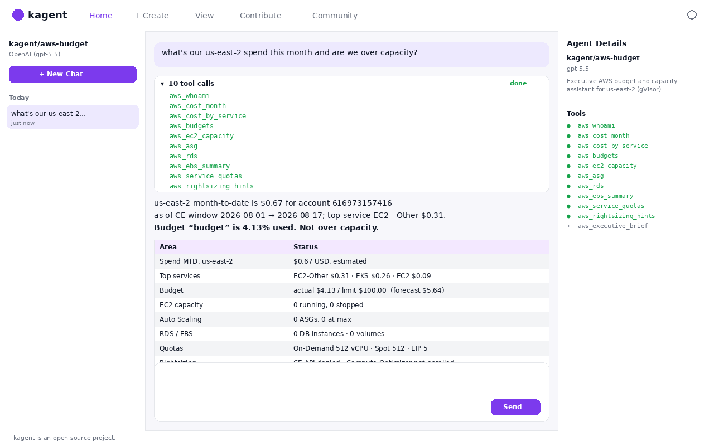
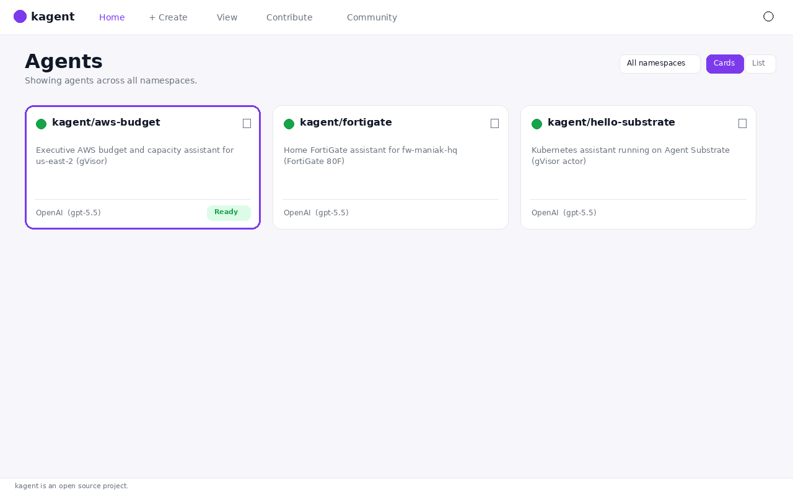

# Shots

Live Viper captures for `aws-budget` (2026-08-16). The GIF and UI stills are a **reconstructed reel of a real A2A turn**, not Chromium pixel captures of the SPA. `cli-live-status.png` is a live kubectl still.

