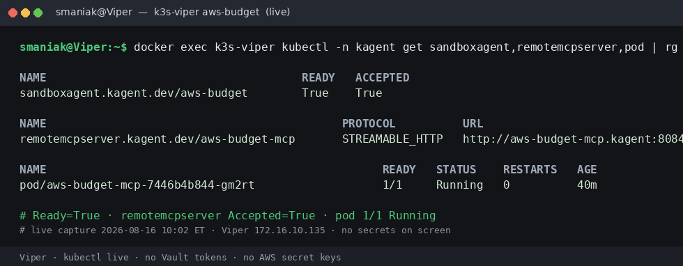
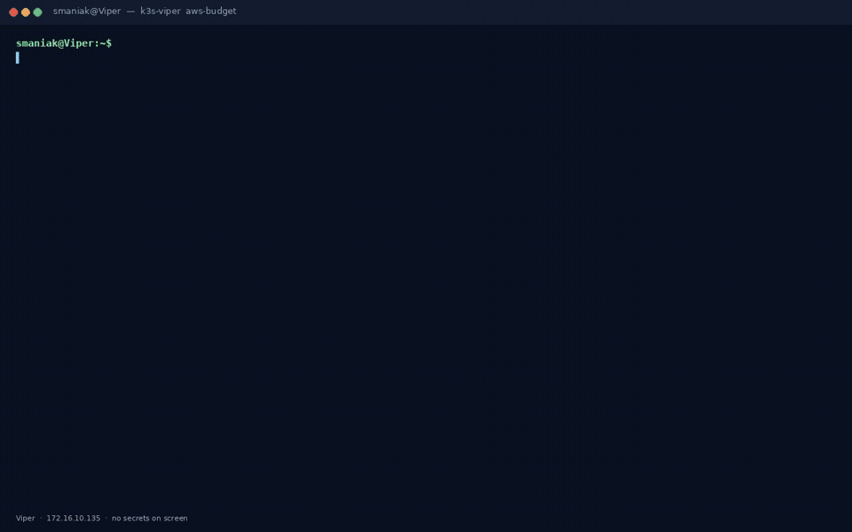

# Shots

Live Viper captures for `aws-budget` (2026-08-16, America/Toronto).
Visual landing: [../README.md](../README.md). Why these are isolated
sandboxes, not plain Agents: [../JOURNEY.md](../JOURNEY.md).

**Live UI** (Chromium screenshot of the tunneled kagent SPA,
2026-08-16 — not reconstructed):

*Three SandboxAgent cards. `aws-budget` description: “Executive AWS
budget and capacity assistant for us-east-2 (gVisor).”*

*User asked us-east-2 spend and capacity. 10/10 tools. MTD $0.67.
Budget $4.13 / $100. 0 EC2 / 0 ASG / 0 RDS / 0 EBS.*

**Live CLI**

**Reconstructed reel** of the same live A2A turn (not a Chromium
pixel capture of the SPA):

