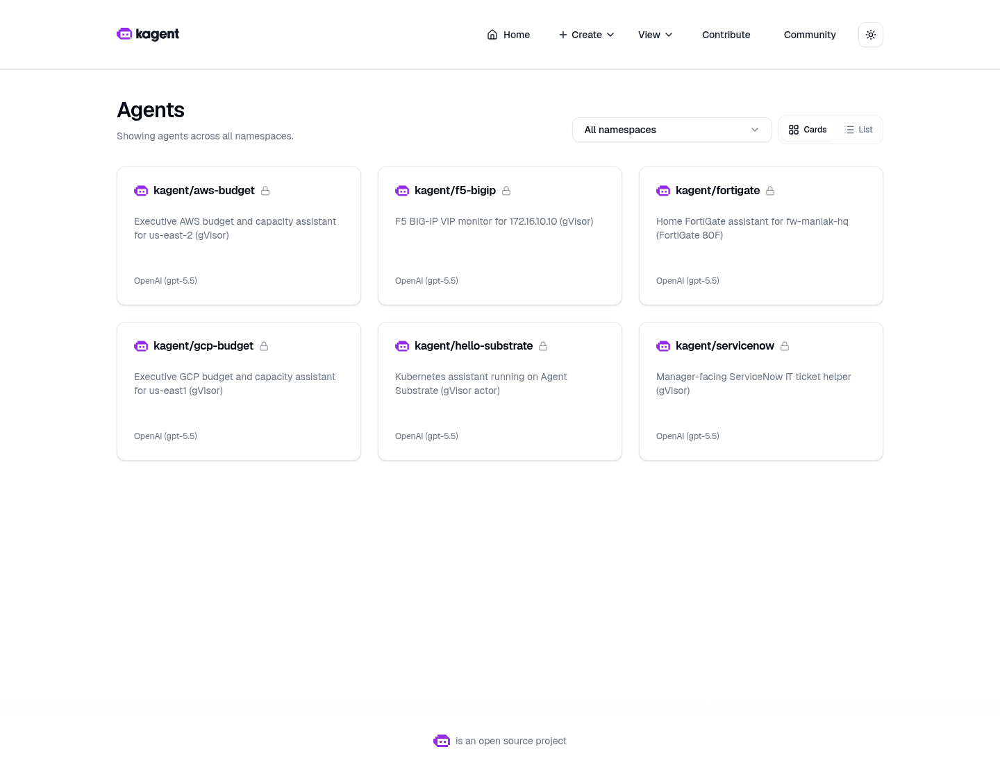
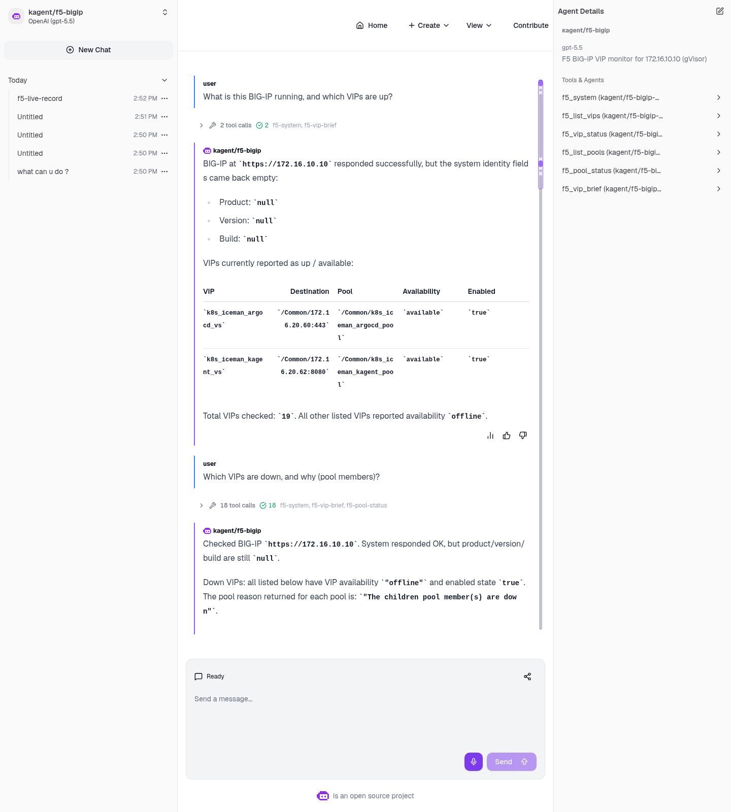
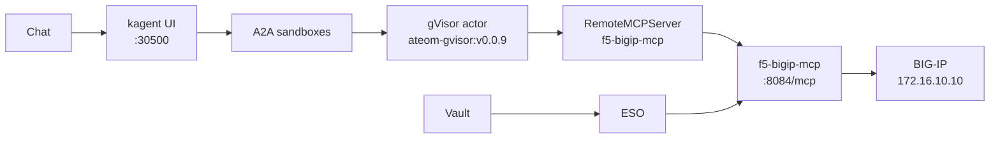

# f5-bigip-sandbox-agent

A gVisor `SandboxAgent` for the lab F5 BIG-IP
(`https://172.16.10.10`) on Viper (kagent **0.10.0-rc2** +
Agent Substrate **0.0.9**).

GitOps (manifests + MCP image) lives in
[sebbycorp/k8s-viper](https://github.com/sebbycorp/k8s-viper).
This folder is the **live-run record**.

## Live screenshots



*Live kagent UI, 2026-08-17. Isolated sandboxes (not plain Agents) —
`kagent/f5-bigip` is on the grid.*



*Live kagent UI, 2026-08-17. Isolated sandbox chat: two VIPs available
(`k8s_iceman_argocd_vs`, `k8s_iceman_kagent_vs`); 17 offline because
pool members are down. `f5_system` returned product/version/build
`null`. The 17-row down table continues below the fold.*

How-to is **[JOURNEY.md](JOURNEY.md)**. What we actually did on Viper
(2026-08-17, America/Toronto): **[REPORT.md](REPORT.md)**.
k8s-viper runbook: [docs/f5-bigip-agent.md](https://github.com/sebbycorp/k8s-viper/blob/main/docs/f5-bigip-agent.md).

## Why isolated sandboxes (not a plain Agent)

A normal kagent `Agent` is a Kubernetes Deployment: always on, same
isolation as any other pod. Fine for a cluster helper.

This agent talks to the lab load balancer. The model gets a filesystem,
memory, and a network for the whole chat. Substrate puts that session
in a **gVisor actor** (`SandboxAgent`) on WorkerPool `kagent-default`:

- Isolated sandbox: gVisor is the wall between the model session and
  the Viper/k3s host. Tools still call iControl REST through the MCP
  pod; the BIG-IP password stays in Vault, not in the actor.
- Idle chats snapshot (zstd) and free the worker. Next message
  restores the same session instead of booting a new container.
- No always-on pod per conversation.
- Golden snapshot you can resume.

**Tradeoff on this lab:** nested gVisor on dockerized k3s, and
snapshots are in-cluster rustfs today (`gs://` is a URI prefix only),
not GCS.

The kagent UI shows a **Sandbox: Agent Substrate** badge. Classic
`/api/a2a/` 404s (no `Agent` CR); the UI uses
`/api/a2a-sandboxes/kagent/f5-bigip`.

## Architecture

Chat → kagent UI `:30500` → A2A sandboxes → gVisor actor →
`RemoteMCPServer` → `f5-bigip-mcp` → BIG-IP **172.16.10.10**.
Vault / ESO sit on the side (password never in the actor).



## Pins (do not bump)

| Piece | Value |
|-------|--------|
| kagent OSS Helm + CRDs | `0.10.0-rc2` |
| Agent Substrate Helm + CRDs | `0.0.9` |
| Worker image | `ghcr.io/kagent-dev/substrate/ateom-gvisor:v0.0.9` |
| Pattern | Go Declarative `SandboxAgent` + FastMCP + `RemoteMCPServer` + ExternalSecret |
| Model | `default-model-config` (Viper: gpt-5.5 via agentgateway) |
| Box | F5 BIG-IP · `https://172.16.10.10` · LAN-only, self-signed |
| BIG-IP identity | `f5_system` returned product/version/build `null` on 2026-08-17 |

rc2 always writes `ActorTemplate` with `spec.pauseImage` and
`env[].valueFrom.secretKeyRef`. Substrate **0.0.9** accepts that shape.
**0.0.12** does not.

## Folder

```text
f5-bigip-sandbox-agent/
  README.md                 # visual landing (this file)
  JOURNEY.md                # how-to (GitOps is in k8s-viper)
  REPORT.md                 # what we actually did on Viper (2026-08-17)
  shots/                    # live Chromium UI + live CLI dump
```

## Docs

| If you want… | Open |
|--------------|------|
| What we actually did on Viper | [REPORT.md](REPORT.md) |
| How-to | [JOURNEY.md](JOURNEY.md) |
| GitOps runbook | [k8s-viper docs/f5-bigip-agent.md](https://github.com/sebbycorp/k8s-viper/blob/main/docs/f5-bigip-agent.md) |
| Manifests | [k8s-viper platform/kagent-ai](https://github.com/sebbycorp/k8s-viper/tree/main/platform/kagent-ai) (`f5-bigip-*.yaml`) |
| MCP image | [k8s-viper images/f5-bigip-mcp](https://github.com/sebbycorp/k8s-viper/tree/main/images/f5-bigip-mcp) |
| All shots | [shots/](shots/) |

## Honest limits

- Image must be imported on the k3s node (`ctr images import`) before the MCP pod starts.
- Vault path `secret/platform/f5-bigip` must exist or ExternalSecret stays unsynced.
- kagent UI `http://172.16.10.135:30500/` is **LAN-only**.
- There is **no** generic “call any iControl path” tool and no tmsh.
- There are **no write tools**. The agent cannot create, delete, disable, or change virtuals, pools, or monitors.
- `f5_system` can return empty identity fields (`null` product/version/build). Do not invent a TMOS version.
- Never commit the F5 password or Vault secret **values**.
