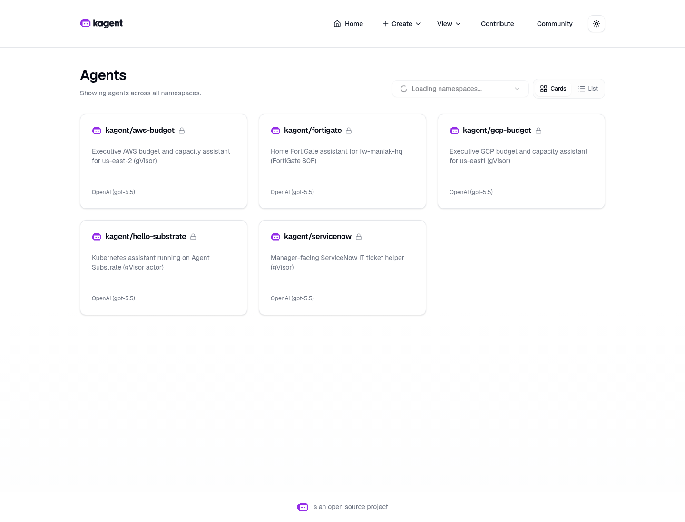
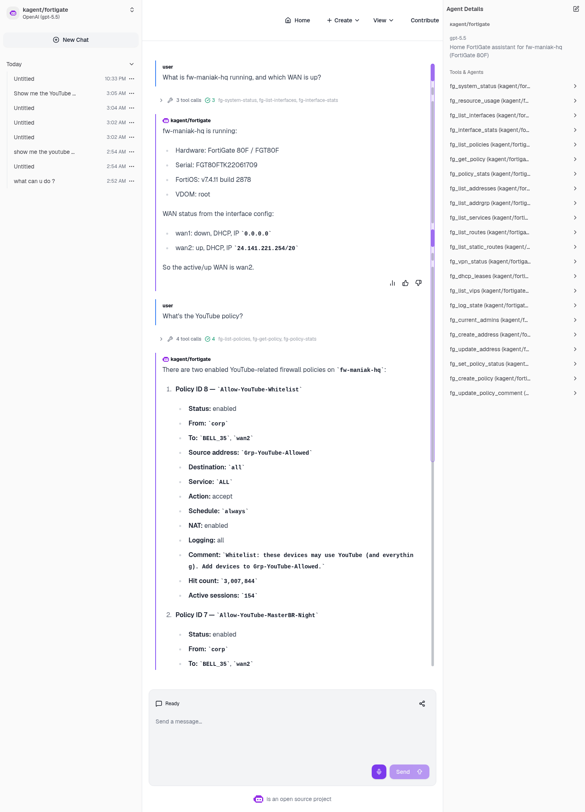
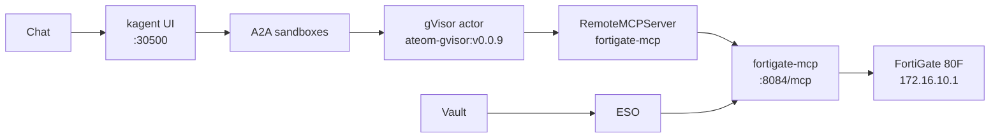

# fortigate-sandbox-agent

A gVisor `SandboxAgent` for the home FortiGate **80F**
(`fw-maniak-hq`, `172.16.10.1`) on Viper (kagent **0.10.0-rc2** +
Agent Substrate **0.0.9**).

GitOps (manifests + MCP image) lives in
[sebbycorp/k8s-viper](https://github.com/sebbycorp/k8s-viper).
This folder is the **live-run record**.

## Live screenshots



*Live kagent UI, 2026-08-16. Isolated sandboxes (not plain Agents) —
`kagent/fortigate` is on the grid.*



*Live kagent UI, 2026-08-16. Isolated sandbox chat: FortiOS v7.4.11,
wan2 up, two YouTube allow policies.*

How-to is **[JOURNEY.md](JOURNEY.md)**. What we actually did on Viper
(2026-08-16, America/Toronto): **[REPORT.md](REPORT.md)**.
k8s-viper runbook: [docs/fortigate-agent.md](https://github.com/sebbycorp/k8s-viper/blob/main/docs/fortigate-agent.md).

## Why isolated sandboxes (not a plain Agent)

A normal kagent `Agent` is a Kubernetes Deployment: always on, same
isolation as any other pod. Fine for a cluster helper.

This agent talks to a home firewall. The model gets a filesystem,
memory, and a network for the whole chat. Substrate puts that session
in a **gVisor actor** (`SandboxAgent`) on WorkerPool `kagent-default`:

- Isolated sandbox: gVisor is the wall between the model session and
  the Viper/k3s host. Tools still call FortiOS through the MCP pod;
  the REST token stays in Vault, not in the actor.
- Idle chats snapshot (zstd) and free the worker. Next message
  restores the same session instead of booting a new container.
- No always-on pod per conversation.
- Golden snapshot you can resume.

**Tradeoff on this lab:** nested gVisor on dockerized k3s, and
snapshots are in-cluster rustfs today (`gs://` is a URI prefix only),
not GCS.

The kagent UI shows a **Sandbox: Agent Substrate** badge. Classic
`/api/a2a/<ns>/<name>` 404s (no `Agent` CR); the UI uses
`/api/a2a-sandboxes/kagent/fortigate`.

## Architecture

Chat → kagent UI `:30500` → A2A sandboxes → gVisor actor →
`RemoteMCPServer` → `fortigate-mcp` → FortiGate **172.16.10.1**.
Vault / ESO sit on the side (token never in the actor).



## Pins (do not bump)

| Piece | Value |
|-------|--------|
| kagent OSS Helm + CRDs | `0.10.0-rc2` |
| Agent Substrate Helm + CRDs | `0.0.9` |
| Worker image | `ghcr.io/kagent-dev/substrate/ateom-gvisor:v0.0.9` |
| Pattern | Go Declarative `SandboxAgent` + FastMCP + `RemoteMCPServer` + ExternalSecret |
| Model | `default-model-config` (Viper: gpt-5.5 via agentgateway) |
| Box | FortiGate **80F** · `fw-maniak-hq` · `172.16.10.1` |
| FortiOS | v7.4.11 build 2878 · VDOM `root` |

rc2 always writes `ActorTemplate` with `spec.pauseImage` and
`env[].valueFrom.secretKeyRef`. Substrate **0.0.9** accepts that shape.
**0.0.12** does not.

## Folder

```text
fortigate-sandbox-agent/
  README.md                 # visual landing (this file)
  JOURNEY.md                # how-to (GitOps is in k8s-viper)
  REPORT.md                 # what we actually did on Viper (2026-08-16)
  shots/                    # live Chromium UI + live CLI dump
```

## Docs

| If you want… | Open |
|--------------|------|
| What we actually did on Viper | [REPORT.md](REPORT.md) |
| How-to | [JOURNEY.md](JOURNEY.md) |
| GitOps runbook | [k8s-viper docs/fortigate-agent.md](https://github.com/sebbycorp/k8s-viper/blob/main/docs/fortigate-agent.md) |
| Manifests | [k8s-viper platform/kagent-ai](https://github.com/sebbycorp/k8s-viper/tree/main/platform/kagent-ai) |
| MCP image | [k8s-viper images/fortigate-mcp](https://github.com/sebbycorp/k8s-viper/tree/main/images/fortigate-mcp) |
| All shots | [shots/](shots/) |

## Honest limits

- Image must be imported on the k3s node (`ctr images import`) before the MCP pod starts.
- Vault path `secret/platform/fortigate` must exist or ExternalSecret stays unsynced.
- kagent UI `http://172.16.10.135:30500/` is **LAN-only**.
- There is **no** generic “run any FortiOS CLI” tool. No delete, backup, or firmware.
- Writes exist (`fg_create_policy`, `fg_set_policy_status`, …) but the agent must ask first.
- Never commit the FortiGate REST token or Vault secret **values**.
