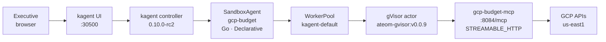
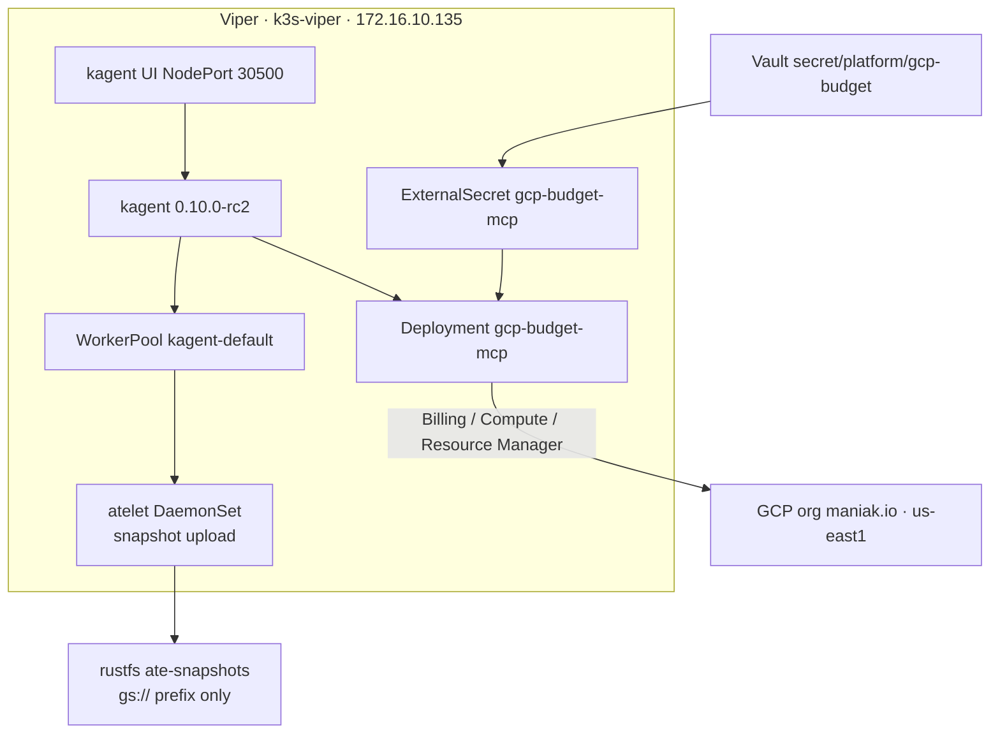

# Architecture

Executive chat in the kagent UI becomes a gVisor actor that calls a
read-mostly FastMCP server, which calls GCP **us-east1** (org
**maniak.io**). Actor memory snapshots land on in-cluster **rustfs**
today (`gs://ate-snapshots/kagent/gcp-budget` prefix).

## Request path



Same path in the lab's usual text form:

```text
kagent UI :30500
    → SandboxAgent/gcp-budget  (Go, modelConfig default-model-config)
        → Agent Substrate WorkerPool kagent-default  (gVisor ateom)
            → RemoteMCPServer/gcp-budget-mcp
                  http://gcp-budget-mcp.kagent:8084/mcp
                → Deployment/gcp-budget-mcp  (image gcp-budget-mcp:dev)
                    → GCP us-east1  (SA JSON from Vault via ExternalSecret)
```

## Secrets and snapshots



## Skills (systemMessage, not a mount)

kagent 0.10.0-rc2 `SandboxAgentSpec` **rejects** `spec.skills`
(`!has(self.skills)`). There is no CRD field that mounts
`skills/*.md` into the gVisor actor. Live Viper
(`fortigate`, `hello-substrate`, `aws-budget`, `servicenow`) puts
instructions in `declarative.systemMessage`.

This demo keeps the markdown under `skills/` and applies the same
text as ConfigMap `gcp-budget-skills`. `declarative.promptTemplate.dataSources`
(a published rc2 field) includes those keys into `systemMessage`. The
actor sees the skill text in the prompt, not as files under `/skills`.

## Why this is not a plain `Agent` Deployment

A regular kagent `Agent` is a long-running pod. `SandboxAgent` is a
**Substrate actor**: idle sessions checkpoint (zstd) and the worker is
freed. The next chat restores from a snapshot inside **gVisor**, so
untrusted tool use stays off the k3s host. That is the point of this demo.

## Snapshot location (omit snapshotsConfig)

| Layer | What it is | What we set **today** |
|-------|------------|-------------|
| kagent CRD | `SandboxAgent.spec.substrate.snapshotsConfig.location` | **Omitted** (hello-substrate / fortigate / aws-budget / servicenow). Default: `gs://ate-snapshots/kagent/gcp-budget` |
| atelet backend | Chosen at **atelet startup** | Live Viper: `ATE_STORAGE_BACKEND=s3` → rustfs `:9000`, bucket `ate-snapshots` |

`gs://` is a prefix only. Bytes live on rustfs. Do **not** set
`gs://viper-kagent-ate-snapshots` while atelet still talks to rustfs.
kagent 0.10.0-rc2 will **reject** `s3://…` on the CRD field.
No `ignoreDifferences`.

## MCP tools (read-only)

| Tool | GCP API (typical) |
|------|-------------------|
| `gcp_whoami` | mounted SA email + `GCP_PROJECT` / `GCP_REGION` / billing account id |
| `gcp_cost_month` | Cloud Billing `accounts.get` + `list_project_billing_info` + budgets list. **No MTD spend field** — tool says unavailable instead of inventing dollars |
| `gcp_budgets` | Cloud Billing Budget `budgets.list` (configured limits) |
| `gcp_cost_by_service` | same honesty: Catalog is SKU prices, not invoices |
| `gcp_compute_capacity` | Compute Engine `instances.aggregatedList` + `disks.aggregatedList` in **us-east1** |
| `gcp_quotas` | Compute Engine `regions.get` quotas for **us-east1** |
| `gcp_projects` | Resource Manager `projects.search` |
| `gcp_executive_brief` | composes the above |

No generic CLI. No project-delete, IAM-create, or budget-delete.

## Related

- Visual landing: [../README.md](../README.md)
- Human walkthrough: [../JOURNEY.md](../JOURNEY.md)
- Pins and pairing: same as [k8s-viper `docs/kagent-substrate.md`](https://github.com/sebbycorp/k8s-viper/blob/main/docs/kagent-substrate.md)
