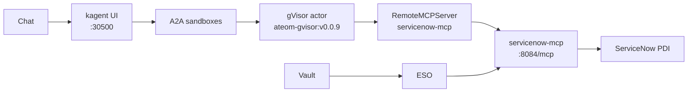

# service-now-sandbox-agent

A gVisor `SandboxAgent` for manager-facing ServiceNow **IT tickets**
on a personal developer instance
(`https://dev203166.service-now.com`) on Viper (kagent **0.10.0-rc2**
+ Agent Substrate **0.0.9**).

## Live screenshots

Shots land here after the first live Viper apply. Placeholders only —
no reconstructed or fake UI captures in this scaffold.

See **[shots/README.md](shots/README.md)**.

How-to is **[JOURNEY.md](JOURNEY.md)**.

## Why isolated sandboxes (not a plain Agent)

A normal kagent `Agent` is a Kubernetes Deployment: always on, same
isolation as any other pod. Fine for a cluster helper.

This agent talks to a ServiceNow instance. The model gets a filesystem,
memory, and a network for the whole chat. Substrate puts that session
in a **gVisor actor** (`SandboxAgent`) on WorkerPool `kagent-default`:

- Isolated sandbox: gVisor is the wall between the model session and
  the Viper/k3s host. Tools still call ServiceNow through the MCP pod;
  username/password stay in Vault, not in the actor.
- Idle chats snapshot (zstd) and free the worker. Next message
  restores the same session instead of booting a new container.
- No always-on pod per manager conversation.
- Golden snapshot you can resume.

**Tradeoff on this lab:** nested gVisor on dockerized k3s, and
snapshots are in-cluster rustfs today (`gs://` is a URI prefix only),
not GCS.

The kagent UI shows a **Sandbox: Agent Substrate** badge. Classic
`/api/a2a/<ns>/<name>` 404s (no `Agent` CR); the UI uses
`/api/a2a-sandboxes/kagent/servicenow`.

## Architecture

Chat → kagent UI `:30500` → A2A sandboxes → gVisor actor →
`RemoteMCPServer` → `servicenow-mcp` → ServiceNow Table API. Vault /
ESO sit on the side (password never in the actor). Full request path
and snapshot notes: **[docs/architecture.md](docs/architecture.md)**.



## What you will have at the end

1. A Go declarative `SandboxAgent` named **`servicenow`** in namespace `kagent`,
   talking through WorkerPool **`kagent-default`** (`ateom-gvisor:v0.0.9`).
2. A FastMCP server (`servicenow-mcp:dev`) on **`:8084/mcp`**
   (`STREAMABLE_HTTP`), registered as `RemoteMCPServer/servicenow-mcp`.
3. ServiceNow credentials in **Vault** `secret/platform/servicenow`
   (keys `host`, `username`, `password`), synced by External Secrets
   Operator. **No passwords in git.** Host name only:
   `https://dev203166.service-now.com`.
4. Substrate snapshots on **rustfs** today (`gs://ate-snapshots/kagent/servicenow`
   prefix; omit `snapshotsConfig`, same as hello-substrate / fortigate /
   aws-budget).
5. A chat in the kagent UI (`http://172.16.10.135:30500/`) that can answer:

   > What IT tickets are open, and how should we organize them?

   with **real** Table API numbers — never invented.

## Pins (do not bump)

| Piece | Value |
|-------|--------|
| kagent OSS Helm + CRDs | `0.10.0-rc2` |
| Agent Substrate Helm + CRDs | `0.0.9` |
| Worker image | `ghcr.io/kagent-dev/substrate/ateom-gvisor:v0.0.9` |
| Pattern | Go Declarative `SandboxAgent` + FastMCP + `RemoteMCPServer` + ExternalSecret |
| Model | `default-model-config` (Viper: gpt-5.5 via agentgateway) |
| ServiceNow host (name only) | `https://dev203166.service-now.com` |

rc2 always writes `ActorTemplate` with `spec.pauseImage` and
`env[].valueFrom.secretKeyRef`. Substrate **0.0.9** accepts that shape.
**0.0.12** does not. Do not “upgrade to fix” a Ready=False agent.

## Folder

```text
service-now-sandbox-agent/
  README.md                 # visual landing (this file)
  JOURNEY.md                # how-to
  shots/                    # placeholders until first live Viper apply
  docs/                     # architecture, runbooks, security
  skills/                   # source for ConfigMap servicenow-skills
  images/servicenow-mcp/    # FastMCP image
  k8s/                      # SandboxAgent + MCP + ExternalSecret + skills ConfigMap
  scripts/                  # prereqs, image import, ServiceNow smoke
```

## Docs

| If you want… | Open |
|--------------|------|
| Architecture (full mermaid + request path) | [docs/architecture.md](docs/architecture.md) |
| How-to (every click) | [JOURNEY.md](JOURNEY.md) |
| Vault / gVisor / Table API | [docs/security.md](docs/security.md) |
| Commands only | [docs/cli-runbook.md](docs/cli-runbook.md) |
| Console clicks only | [docs/ui-runbook.md](docs/ui-runbook.md) |
| Agent skills | [skills/SKILL.md](skills/SKILL.md) |
| Shot placeholders | [shots/](shots/) |

## Honest limits

- Image must be imported on the k3s node (`ctr images import`) before the MCP pod starts.
- Vault path must exist or ExternalSecret stays unsynced.
- There is **no** generic shell. No incident create, close, or delete.
- Writes (`sn_add_work_note`, `sn_assign_incident`) exist but the agent
  must **ask first**.
- Never commit ServiceNow password or username **values**.
