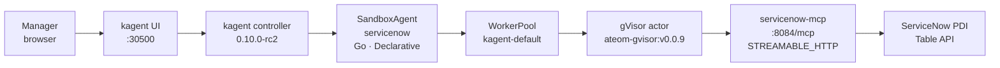
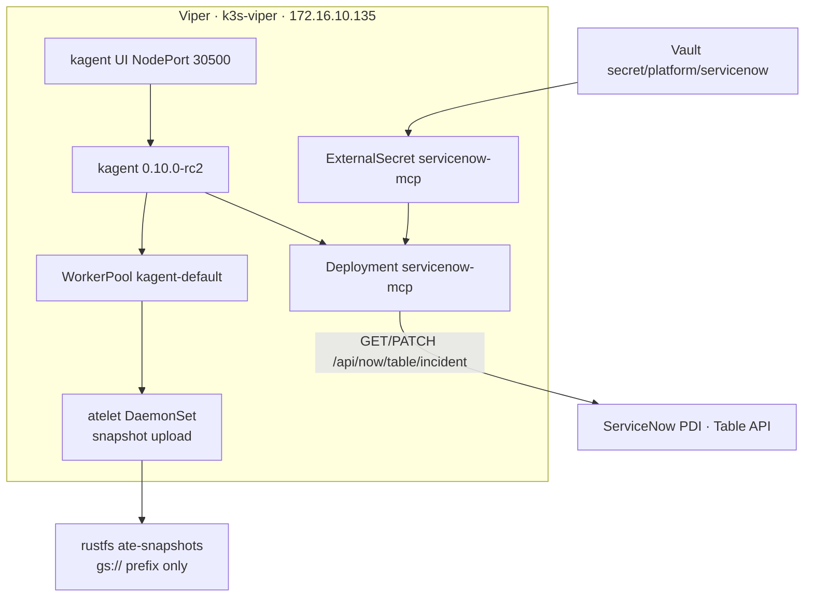

# Architecture

Manager chat in the kagent UI becomes a gVisor actor that calls a
read-mostly FastMCP server, which calls a ServiceNow **personal
developer instance** (host name only: `https://dev203166.service-now.com`).
Actor memory snapshots land on in-cluster **rustfs** today
(`gs://ate-snapshots/kagent/servicenow` prefix).

## Request path



Same path in the lab's usual text form:

```text
kagent UI :30500
    → SandboxAgent/servicenow  (Go, modelConfig default-model-config)
        → Agent Substrate WorkerPool kagent-default  (gVisor ateom)
            → RemoteMCPServer/servicenow-mcp
                  http://servicenow-mcp.kagent:8084/mcp
                → Deployment/servicenow-mcp  (image servicenow-mcp:dev)
                    → ServiceNow Table API  (basic auth from Vault via ExternalSecret)
```

## Secrets and snapshots



## Skills (systemMessage, not a mount)

kagent 0.10.0-rc2 `SandboxAgentSpec` **rejects** `spec.skills`
(`!has(self.skills)`). There is no CRD field that mounts
`skills/*.md` into the gVisor actor. Live Viper
(`fortigate`, `hello-substrate`, `aws-budget`) puts instructions in
`declarative.systemMessage`.

This demo keeps the markdown under `skills/` and applies the same
text as ConfigMap `servicenow-skills`. `declarative.promptTemplate.dataSources`
(a published rc2 field) includes those keys into `systemMessage`. The
actor sees the skill text in the prompt, not as files under `/skills`.

## Why this is not a plain `Agent` Deployment

A regular kagent `Agent` is a long-running pod. `SandboxAgent` is a
**Substrate actor**: idle sessions checkpoint (zstd) and the worker is
freed. The next chat restores from a snapshot inside **gVisor**, so
untrusted tool use stays off the k3s host. That is the point of this demo.

## Snapshot location (omit snapshotsConfig)

| Layer | What it is | What we set **today** |
|-------|------------|-------------|
| kagent CRD | `SandboxAgent.spec.substrate.snapshotsConfig.location` | **Omitted** (hello-substrate / fortigate / aws-budget). Default: `gs://ate-snapshots/kagent/servicenow` |
| atelet backend | Chosen at **atelet startup** | Live Viper: `ATE_STORAGE_BACKEND=s3` → rustfs `:9000`, bucket `ate-snapshots` |

`gs://` is a prefix only. Bytes live on rustfs. Do **not** set
`gs://viper-kagent-ate-snapshots` while atelet still talks to rustfs.
kagent 0.10.0-rc2 will **reject** `s3://…` on the CRD field.

## MCP tools (read-only first)

| Tool | ServiceNow API (typical) |
|------|--------------------------|
| `sn_whoami` | `GET /api/now/table/sys_user` (mounted user_name) |
| `sn_list_incidents` | `GET /api/now/table/incident` `active=true` |
| `sn_get_incident` | `GET /api/now/table/incident` by number or sys_id |
| `sn_search_incidents` | `GET /api/now/table/incident` LIKE number/short_description |
| `sn_incident_summary` | `GET /api/now/stats/incident` group by state / priority |
| `sn_list_requested_items` | `GET /api/now/table/sc_req_item` `active=true` |
| `sn_add_work_note` | `PATCH /api/now/table/incident/{sys_id}` `work_notes` (write; ask first) |
| `sn_assign_incident` | `PATCH /api/now/table/incident/{sys_id}` `assigned_to` (write; ask first) |

No generic shell. No password print. No incident create / close / delete.

## Related

- Visual landing: [../README.md](../README.md)
- Human walkthrough: [../JOURNEY.md](../JOURNEY.md)
- Pins and pairing: same as [k8s-viper `docs/kagent-substrate.md`](https://github.com/sebbycorp/k8s-viper/blob/main/docs/kagent-substrate.md)
